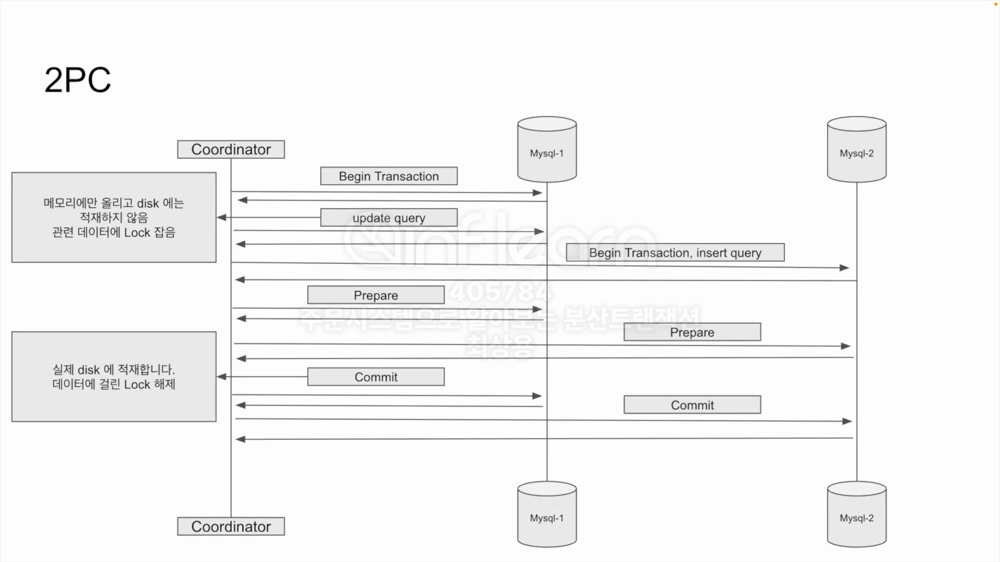
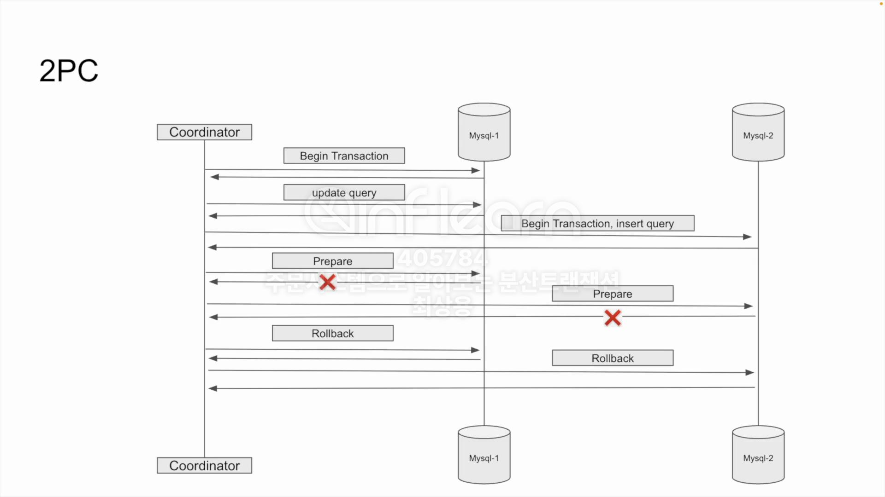
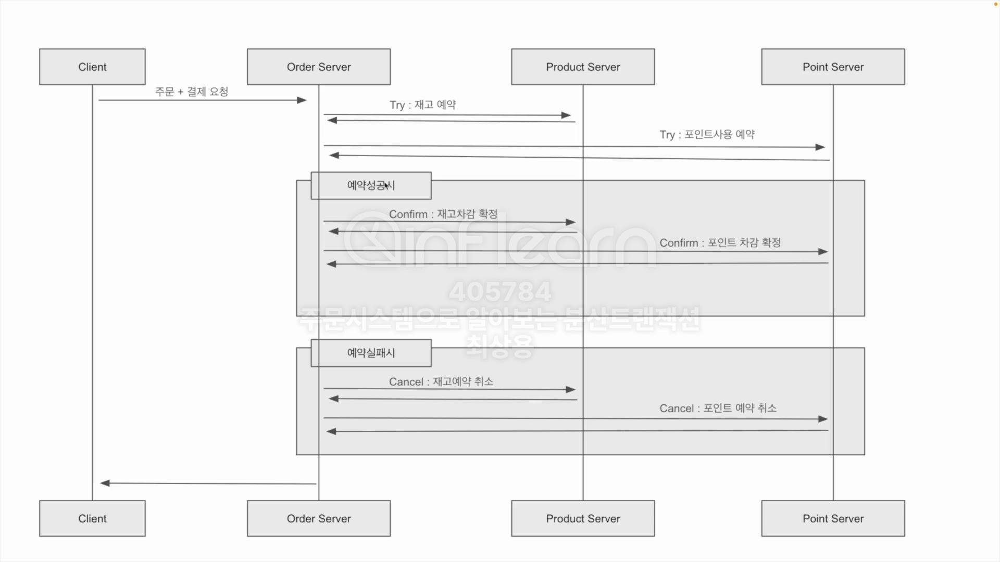

## 요구사항

- 주문 데이터를 저장하여야 한다
- 재고 관리를 하여야 한다
- 포인트를 사용해야 한다
- 주문, 재고, 포인트 데이터의 정합성이 맞아야 한다
- 동일한 주문은 1번만 이루어져야 한다

## 분산 트랜잭션

### PC (Two-Phase Commit Protocol)

- 분산 시스템에서 트랜잭션의 원장성을 보장하기 위해 트랜잭션을 두 단계로 나누어 처리하는 프로토콜
- 처리 방법
  - Prepare 단계: 트랜잭션 매니저가 참여자에게 트랜잭션을 준비하도록 요청
  - Commit 단계: 모든 참여자가 준비가 되었다는 응답을 받으면 트랜잭션 매니저가 커밋을 수행
- 대표적인 구현으로는 XA 트랜잭션이 존재함

#### 해피케이스



#### 실패케이스



```sql
# XA 트랜잭션
xa start
xa end

# XA 트랜잭션을 위한 prepare 단계
xa prepare

# XA 트랜잭션 commit 단계
xa commit
```

장점
- 강력한 정합성 보장
- 데이터베이스 벤더가 XA를 지원하면 구현 난이도가 낮음

단점
- 사용하는 벤더가 XA를 지원하지 않으면 구현하기 어려움
- prepare 단계이후 commit이 완료될때까지 락을 유지하기 때문에 
  - 성능 저하가 발생할 수 있음
  - 다른 트랜잭션이 대기 상태에 빠질 수 있음
- 장애 복구시 복잡도가 증가함

## TCC(Try-Confirm-Cancel)

- Try-Confirm-Cancel 단계로 나누어 트랜잭션을 관리하여 분산 시스템에서 데이터 정합성을 보장하는 분산 트랜잭션 방식
- Try, Confirm, Cancel 단계는 멱등하게 설계되어야 함
  - Try: 필요한 리소스를 점유할 수 있는지 검사하고 예약하는 단계
  - Confirm: Try 단계에서 예약한 리소스를 실제로 사용하여 작업을 완료하는 단계
  - Cancel: 문제가 생긴경우 Try 단계에서 예약한 리소스를 취소하고 원복하는 단계



장점
- 확장성과 성능에 유리
  - 2PC에 비해 전역 트랜잭션을 유지하지 않기 때문에 락 점유시간이 짧아지고 롱 트랜잭션에 덜 취약함
- 장애 복구와 재시도 처리에 유연함
  - 비즈니스 정책에 따라 전략을 정할 수 있음

단점
- 기존 시스템에 비해 설계와 구현이 복잡
  - 모든 단계가 멱등성으로 설계되어야 하므로 네트워크 오류, 재시도 시나리오를 고려한 로직 구현이 필요
